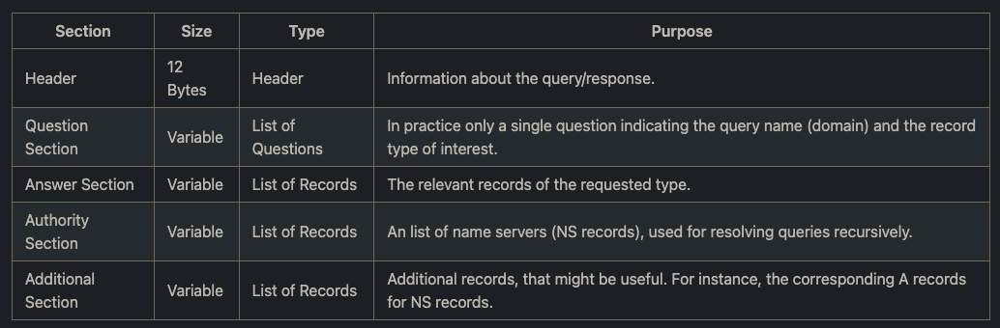
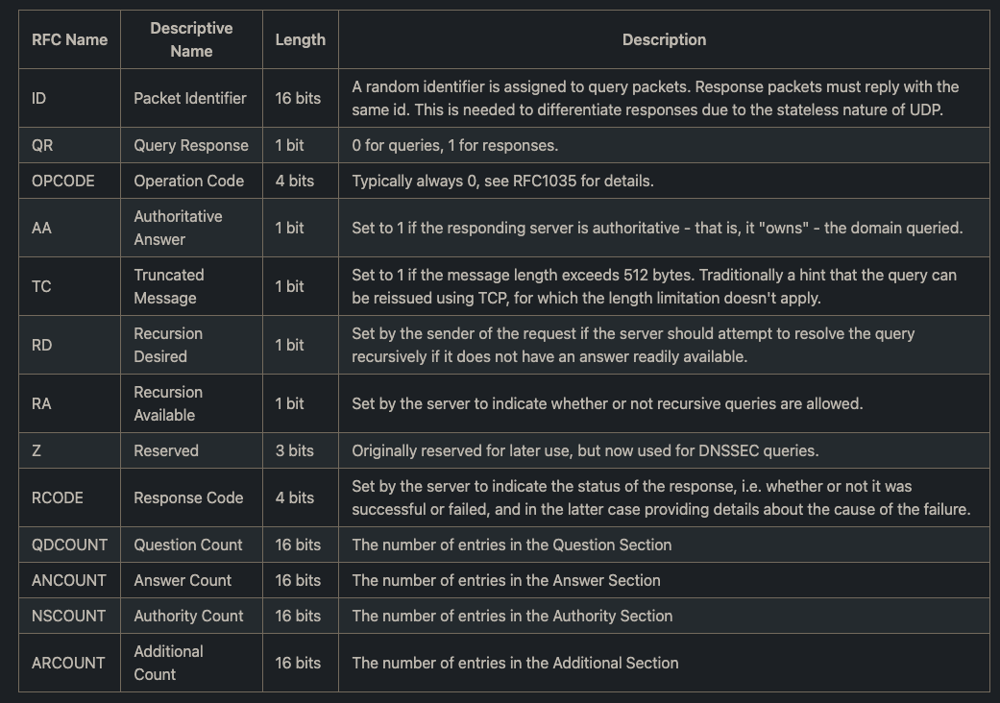
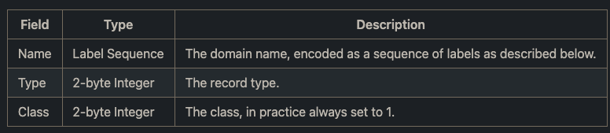
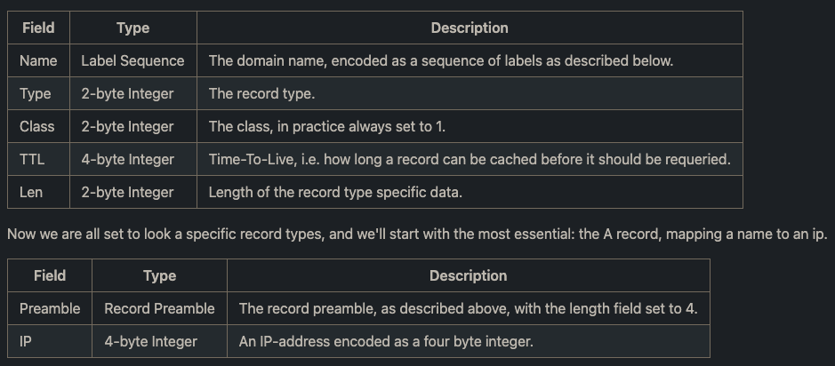

# Notes

* Conventionally, DNS packets are sent using UDP transport and are limited to
  512 bytes. s we'll see later, both of those rules have exceptions: DNS can be
  used over TCP as well, and using a mechanism known as eDNS we can extend the
  packet size. For now, we'll stick to the original specification, though.

* DNS is quite convenient in the sense that queries and responses use the same
  format. This means that once we've written a packet parser and a packet
  writer, our protocol work is done. This differs from most Internet Protocols,
  which typically use different request and response structures. On a high
  level, a DNS packet looks as follows:

## Package

## Header

Essentially, we have to support three different objects: Header, Question and
Record. Conveniently, the lists of records and questions are simply individual
instances appended in a row, with no extras. The number of records in each
section is provided by the header. The header structure looks as follows:

## Question

## Records

Finally, we've got the records which are the meat of the protocol. Many record
types exists, but for now we'll only consider a few essential. All records have
the following preamble:

